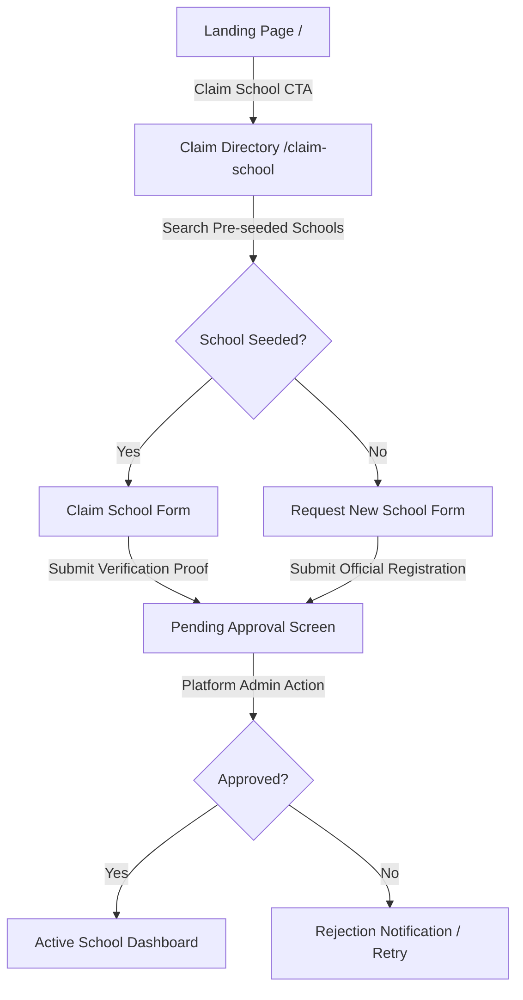
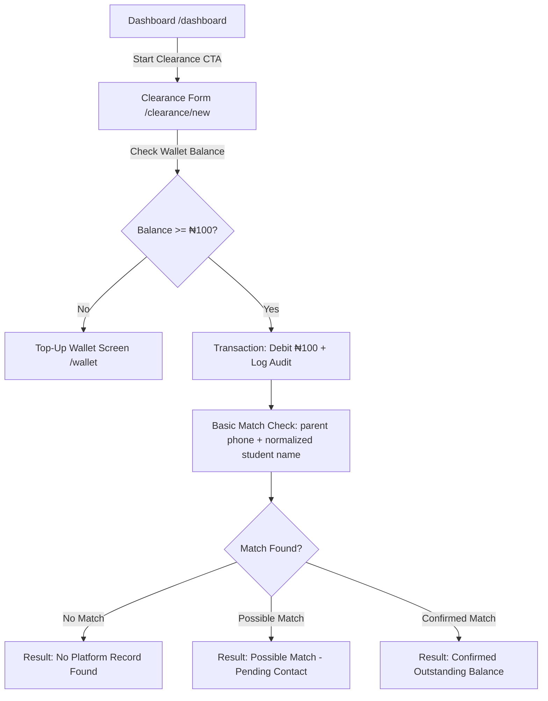

# EduClearance UX Strategy & Design System Specifications

This document defines the UX Strategy, Sitemap, Design System Tokens, Core User Flows, and build-ready Low-Fidelity Screen Specifications for **EduClearance**, a private school-to-school student transfer clearance network for local school clusters in Nigeria.

---

## 1. Visual Direction & UX Strategy

EduClearance is a **professional verification utility**, not a flashy fintech and not a government portal. The design must project **trust, official calm, and local accessibility**. 

### UX Core Pillars
1. **Utility-First, Mobile-Optimized:** Designed primarily for mobile web (school owners and admin staff checking clearances on their phones in admissions offices), while scaling gracefully to a clean desktop SaaS dashboard.
2. **Clearance Request Workflow (Not a Blacklist Search):** Every verification is framed as an active, audit-logged *request*, not a passive search of a "debtor list." This legally and socially positions the tool as a collaborative inter-school network.
3. **Calm, Non-Alarmist States:** Avoid using alarmist red/amber tones unless there is a confirmed unresolved issue. Possible matches are treated with calm warnings, and clear distinction is made between "No record found" and "Cleared."
4. **Friction-Free Contribution:** Reporting an unresolved issue is free and easy to encourage network health, while consumption is paid to prevent frivolous queries.

---

## 2. Sitemap Table

The following sitemap lists all the required pages for the EduClearance MVP, mapping their access levels and responsive design modes.

| Route | Page Name | Access Level | Primary Layout Mode | Core Action / Function |
| :--- | :--- | :--- | :--- | :--- |
| `/` | **Landing Page** | Public | Mobile-first / Landing | Product introduction, pricing, and onboarding CTA |
| `/login` | **Sign In** | Public | Centered Form | Authenticate school owners and platform admins |
| `/register` | **Sign Up** | Public | Centered Form | Create school owner user account |
| `/claim-school` | **Claim / Register School** | Auth (Pre-approval) | Single-column Form | Search pre-seeded directory to claim, or request a new school |
| `/dashboard` | **Active School Dashboard** | Auth (School active) | App Shell (Sidebar + Grid) | Wallet balance, quick clearance trigger, case lists, reported issues |
| `/clearance/new` | **Start Clearance Request** | Auth (School active) | Single-column Form | Input student/parent details, confirm ₦100 credit deduction |
| `/clearance/[id]` | **Clearance Case Detail** | Auth (School active) | Column/Details Card | Display result (match, no-match, possible-match), disclaimers, previous school contact, and dispute button |
| `/clearance` | **Clearance History** | Auth (School active) | Responsive List/Table | Searchable index of all clearances initiated by the school |
| `/issues/new` | **Report Unresolved Issue** | Auth (School active) | Multi-step Form | Report outstanding balances/unresolved issues for free |
| `/issues` | **Reported Issues List** | Auth (School active) | Responsive List/Table | View and resolve issues this school has reported |
| `/wallet` | **Wallet & Billing** | Auth (School active) | Simple Grid / Billing | Check balance, initialize Paystack top-up, view transaction log |
| `/admin` | **Admin Hub** | Auth (Platform Admin) | Admin App Shell | Core metrics, pending approvals queue, recent dispute alerts |
| `/admin/schools` | **School Approval Portal** | Auth (Platform Admin) | Admin Table / Actions | Review claims, approve/reject/suspend school profiles |
| `/admin/wallets` | **Wallet Operations** | Auth (Platform Admin) | Admin Table / Adjustments | View school balances, manually credit/debit, audit logs |
| `/admin/clearance` | **Global Clearances** | Auth (Platform Admin) | Admin Table | Monitor platform-wide clearance checks and activity |
| `/admin/issues` | **Global Issues Directory** | Auth (Platform Admin) | Admin Table | Monitor reported issues and evidence uploads |
| `/admin/disputes` | **Dispute Resolution Hub** | Auth (Platform Admin) | Admin Table / Details | Review parent/school challenges, edit statuses, audit changes |

---

## 3. Design System Tokens (Tailwind Config)

```javascript
// tailwind.config.js - Selected Palette & Styling Tokens
module.exports = {
  theme: {
    extend: {
      colors: {
        background: {
          DEFAULT: '#FAF9F6', // Off-White/Cream: Calm, soft, authoritative backdrop
          card: '#FFFFFF',
          secondary: '#F5F2EB', // Muted cream for sidebar, borders, and headers
        },
        navy: {
          50: '#F0F4F8',
          100: '#D9E2EC',
          800: '#1E293B', // Deep Navy/Ink: Main typography and high contrast items
          900: '#0F172A', // Deepest Ink: Header, primary brand titles
        },
        emerald: {
          50: '#ECFDF5',
          100: '#D1FAE5',
          600: '#059669', // Emerald/Teal: Clearances, approved statuses, trust indicators
          700: '#047857',
        },
        amber: {
          50: '#FFFBEB',
          100: '#FEF3C7',
          600: '#D97706', // Soft Amber: Disputes, pending checks, possible matches
          700: '#B45309',
        },
        terracotta: {
          50: '#FEF2F2',
          600: '#DC2626', // Terracotta Red: Outstanding balances, suspended schools
          700: '#B91C1C',
        },
        slate: {
          500: '#64748B', // Neutral gray for helper texts, subtitles
          600: '#475569',
        }
      },
      fontFamily: {
        sans: ['Inter', 'sans-serif'],
        display: ['Outfit', 'sans-serif'], // Professional Google Font pairing
      },
      borderRadius: {
        lg: '8px', // Buttons, forms, inputs
        xl: '12px', // Cards, panels, alerts
        '2xl': '16px', // Large containers, mobile sheets
      },
      boxShadow: {
        sm: '0 1px 2px 0 rgba(15, 23, 42, 0.05)',
        md: '0 4px 6px -1px rgba(15, 23, 42, 0.1), 0 2px 4px -2px rgba(15, 23, 42, 0.05)',
      }
    }
  }
}
```

---

## 4. Core User Flows & Screen Specs

### Flow A: School Claiming & Registration
**Journey:** `Landing Page (/)` -> `Click "Claim Your School"` -> `/claim-school` -> `Search & Claim / Create Request` -> `Submit` -> `/claim-school/pending-approval`.



#### Low-Fidelity Screen Specs:
1. **`/claim-school` (The Claim Portal):**
   - **Header:** Simplified navigation (Logo, Back to Home, Help).
   - **Step Indicator:** Progress tracker: "1. Find School" -> "2. Account Details" -> "3. Submit Verification".
   - **Search Input:** Search bar for local cluster schools. Results appear in an interactive dropdown.
   - **Action Panel:**
     - *If found:* Shows "Claim [School Name]". Clicking displays a form asking for Proprietor Name, Official Email, School Clearance Phone, and a file upload field (e.g., government registration certificate, school letterhead).
     - *If not found:* Shows "Can't find your school? Add it to the directory". Displays a form asking for School Name, Address, Area/State, and Official Contact details.
   - **Footer:** Trust statement: "Verification is conducted by EduClearance admins within 24 hours to prevent unauthorized access."

2. **`/claim-school/pending-approval` (Awaiting State):**
   - **Icon:** Smooth animated hourglass in soft amber.
   - **Title:** "Claim Received & Under Verification".
   - **Body:** "Our team is reviewing your school claim for **[School Name]**. We will contact you at **[Official Phone Number]** or email **[Official Email]** to verify your details. This process takes less than 24 hours."
   - **Security Warning:** "To protect student privacy, your dashboard will remain locked until your verification is approved."

---

### Flow B: Starting a Clearance Request
**Journey:** `Dashboard` -> `Click "Start New Clearance"` -> `/clearance/new` -> `Submit Student Data (charges ₦100)` -> `Deduction & Check` -> `/clearance/[id]`.



#### Low-Fidelity Screen Specs:
1. **`/clearance/new` (The Clearance Form):**
   - **Header:** Core App Shell showing School Name and Wallet Balance ("₦4,500 - 45 checks remaining").
   - **Form Fields:**
     - **Incoming Student Name:** Text input.
     - **Gender:** Radio buttons (Male/Female/Other).
     - **Last Class Attended:** Dropdown (e.g., JSS3, SSS1, Basic 6).
     - **Parent/Guardian Name:** Text input.
     - **Parent/Guardian Phone Number:** Tel input (critical for matching).
     - **Previous School Name:** Dropdown (linked to directory) or manual input.
   - **Payment Confirmation Panel:**
     - A rounded card highlighting the fee: "Cost: ₦100 (1 student check). Remaining Balance after check: ₦4,400."
   - **Submit Button:** "Initiate Verification (Deduct ₦100)" in Deep Navy with loading state helper.

---

### Flow C: Results & Out-of-Platform Verification

#### State 1: No Platform Record Found
- **Status Indicator:** Soft Emerald tag saying "No Platform Record Found".
- **Disclaimer Banner (Mandatory Text):**
  > [!IMPORTANT]
  > **No unresolved record was found on EduClearance. This does not confirm that the student has cleared the previous school. Please contact the previous school directly or wait for their response.**
- **Previous School Card:**
  - Shows details of the previous school if found in the directory.
  - Displays: School Name, Address, **Clearance Officer Contact: [Clearance Phone Number]**.
  - **CTA Button:** "Call Previous School" (starts phone call) or "Contact via WhatsApp".
  - **WhatsApp Message Generator:** Pre-fills a message: *"Hello [Previous School Name], this is [Current School Name] Admitting Office. We are processing the admission of student [Student Name] who listed your school as their previous school. Please let us know if there are any outstanding clearances. Thank you."*
- **Action Button:** "Close After Manual Verification" (updates status to `closed` only after the school confirms they contacted/verified with the previous school).

#### State 2: Confirmed Outstanding Balance
- **Status Indicator:** Muted Terracotta Red tag saying "Unresolved Issue: Outstanding Balance".
- **Student Details Snapshot:** Student name, parent name, parent phone number.
- **Reporting School Info:** "[Previous School Name] has reported an unresolved issue for this student."
- **Issue Details Card:**
  - **Amount Owed:** ₦45,000
  - **Category:** Outstanding School Fees
  - **Academic Session/Term:** 2025/2026 - 2nd Term
  - **Official Note:** "Outstanding balance for tuition and books."
- **Action Paths:**
  - **Primary CTA:** "Message Previous School" (Direct link/WhatsApp trigger to resolve).
  - **Secondary CTA:** "Request Clearance Update" (asks the previous school to mark the issue resolved if payment has been made).
  - **Dispute Button:** "Flag Inaccurate Record / Open Dispute" (opens a dialog to request admin review).

---

### Flow D: Reporting an Unresolved Issue (Free Contribution)
**Journey:** `Dashboard` -> `Click "Report Unresolved Issue"` -> `/issues/new` -> `Fill details & upload optional receipt/letterhead proof` -> `Submit (Free)` -> `/issues`.

#### Low-Fidelity Screen Specs:
1. **`/issues/new` (Report Form):**
   - **Cost Indicator:** Banner highlighting: "Reporting unresolved student issues is free. Helps protect the cluster network."
   - **Form Fields:**
     - **Student Name:** Text input.
     - **Last Class:** Dropdown.
     - **Parent Name & Parent Phone Number:** Text/Tel inputs.
     - **Issue Category:** Dropdown (School Fees, Books, Uniform, Transport, Other).
     - **Outstanding Amount (₦):** Number input (saved in kobo: `amount_owed = input * 100`).
     - **Academic Session & Term:** Dropdowns.
     - **Brief Description/Note:** Textarea.
     - **Supporting Evidence (Optional):** File upload (Receipt copy, ledger printout, school bill).
   - **Ethics Consent Checkbox:** "I certify that this record is accurate, belongs to our school, and matches our physical accounting records."
   - **Submit Button:** "Save Unresolved Issue" in soft emerald/teal.

---

### Flow E: Wallet Top-Up & Billing
**Journey:** `/wallet` -> `Enter amount / Choose package (₦5,000 / ₦10,000 / ₦20,000)` -> `Click Top Up` -> `Initialize Paystack Pop-up` -> `Process Payment` -> `Redirect to Wallet with success notification`.

#### Low-Fidelity Screen Specs:
1. **`/wallet` (Wallet Screen):**
   - **Main Card:** Deep navy background with gold lettering showing current balance (e.g. **₦8,200** / 82 student checks).
   - **Top-Up Quick Select:** Grid of buttons:
     - **₦5,000** (50 checks) - *Recommended*
     - **₦10,000** (100 checks)
     - **₦20,000** (200 checks)
     - **Custom Amount** (input field)
   - **Payment CTA:** "Pay Safely with Paystack" (shows Paystack secure logo, card/bank transfer options).
   - **Transaction Log:** Table containing date, type (credit, debit, refund), amount (kobo formatted to Naira), description ("Clearance check for [Student Name]", "Paystack Credit"), reference, and status.

---

### Flow F: Admin Operations
**Journey:** `/admin` -> `Select Dashboard Section` -> `Perform Action (Approve school, adjust wallet, resolve dispute)`.

#### Low-Fidelity Screen Specs:
1. **`/admin/schools` (Approval Board):**
   - Filter tabs: Pending Approval (with badge count), Active, Suspended.
   - Table of schools showing Logo, Name, Location, Claimed By (User), Date Claimed, and Verification Document Link.
   - Quick Action buttons: **Approve** (Teal), **Decline** (Amber), **Suspend** (Red).
2. **`/admin/wallets` (Balance Controller):**
   - List of schools with search.
   - Details pane showing current balance.
   - Action buttons: "Credit Wallet" / "Debit Wallet" with manual input field, transaction reference text, and description requirement. Updates logged directly to audit trail.
3. **`/admin/disputes` (Dispute Workspace):**
   - Table of disputes showing Date Raised, Clearance ID, School A (Reporting), School B (Admitting), Parent Name, Reason.
   - Detailed view showing case timeline, reported issue evidence, and admin resolution form: "Resolve Dispute (Clear Record / Keep Record / Refund Current School)".

---

## 5. 21st.dev Component Mapping & Theme Styling

To maintain the official, calm, and trustworthy tone of EduClearance, we will use specific 21st.dev components categorized by page/section. We reject flashy, dark-theme gaming/crypto components in favor of clean, light-mode corporate and dashboard elements.

### Theme base
- **Preferred Theme:** [Origin UI Theme](https://21st.dev/community/themes/origin-ui) (highly structured inputs, clean statuses, standard alerts).
- **Secondary Theme:** [Mono Theme](https://21st.dev/community/themes/mono) (simple layouts, lightweight typography).

### Component Selection Table

| Page / Section | 21st.dev Asset URL / Category | How It Will Be Used | Adaptation Notes |
| :--- | :--- | :--- | :--- |
| **Landing Navigation** | [Navbar-navigation](https://21st.dev/s/navbar-navigation) | Simple sticky header with logo, pricing links, and login button. | Remove excessive animations. Keep it simple and clean. |
| **Landing Hero** | [Animated Hero Backgrounds](https://cdn.21st.dev/ravikatiyar162/interactive-hero-backgrounds/default/bundle.1755167312016.html?theme=light) | Calm, subtle geometric background pattern behind the main value prop. | Must be light-themed, very slow speed, color-restricted to soft blue/emerald. |
| **How It Works** | [Grid Feature Cards](https://cdn.21st.dev/sshahaider/grid-feature-cards/default/bundle.1747156095291.html?theme=light) | 3-column layout: 1. Claim School, 2. Run Clearance, 3. Connect & Resolve. | Focus on clean borders and simple typography. No floating effects. |
| **Landing Pricing** | [Pricing Section 4](https://cdn.21st.dev/uilayout.contact/pricing-section-4/default/bundle.1756283776750.html?theme=light) | Simple visual package representation. Large callout for ₦5,000 entry. | Modify text to show Naira credits. Keep custom slider option if needed. |
| **Auth Pages** | [Simple Email or Password Login](https://cdn.21st.dev/larsen66/login-signup/simple-email-or-password-login/bundle.1753197583457.html?theme=light) | Clean centered card for credentials and claim search. | Adapt style to fit deep navy text. |
| **Dashboard Shell** | [Sidebar Component](https://21st.dev/s/sidebar) | Responsive collapsible sidebar containing Home, Clearance, Issues, Wallet. | Collapses to standard bottom-nav on mobile for optimal phone utility. |
| **Forms (new clearance/issue)** | [Origin UI Forms](https://21st.dev/community/themes/origin-ui) | High-fidelity form elements with precise inline validations and focus rings. | Use standard input sizes with larger touch targets on mobile viewports. |
| **Case Detail Results** | [Scrollable Dialog / Modal](https://cdn.21st.dev/sshahaider/dialog/scrollable/bundle.1753272898334.html?theme=light) | Highlighted card containing the safe disclaimer/result state. | Uses soft amber/emerald background banner inside card container. |
| **Wallet / Admin Tables** | [Table Component](https://21st.dev/s/table) | Compact, striped tables showing transactions and claims history. | Enable horizontal scroll for mobile viewports. |
| **Checkboxes / Controls** | [Animated Check Box](https://cdn.21st.dev/ringlabs/animated-check-box/default/bundle.1747471846216.html?theme=light) | Visual feedback confirmation for ethics checkpoint during reporting. | Retain simple check animation to draw visual weight to validation statement. |

---

## 6. Accessibility Notes (WCAG 2.1 AA Compliance)

Targeting proprietors who frequently run clearances on mobile screens in various lighting conditions (e.g. outdoor school gates or bright admissions offices):

- **Contrast Ratios:** Background color `#FAF9F6` (cream) paired with `#0F172A` (deep navy) ensures a contrast ratio higher than **7:1** for body text. All status indicator texts must have a minimum contrast ratio of **4.5:1** against their colored background tags.
- **Mobile Touch Targets:** All interactive elements (CTA buttons, form inputs, dropdown selectors, and tabs) must have a minimum height/width of **48px** with at least **8px** of spacing around them to prevent misclicks on mobile.
- **Form Controls:** Every text input must be explicitly wrapped in or linked to a `<label>` element. Avoid using placeholder text as the only label to prevent cognitive load.
- **Color Independence:** Screen statuses (Cleared, Unresolved, Disputed) must never rely on colors (Green, Red, Amber) alone. They must always display corresponding text descriptors and unique vector icons (Checkmark, Warning Icon, Info Symbol).

---

## 7. Open Design & Implementation Risks

1. **School Search Duplication:** Proprietors might search for a school name, not see it, and create a duplicate instead of claiming the seeded record.
   * *Mitigation:* Require a location search parameter (State -> LGA/Area -> Name) before allowing new school additions, and present fuzzy-matched results first.
2. **Abuse of Free Reporting:** Schools could falsely report parents out of spite.
   * *Mitigation:* Explicitly require billing evidence upload (receipt, invoices, or ledger snapshots) and require the parent phone number. Add an Admin Dispute flag that triggers automatically if contested.
3. **Wallet Depletion During High Volume:** If a school wallet runs dry during peak registration, admissions might stall.
   * *Mitigation:* Integrate a quick top-up shortcut during the clearance creation flow that allows card payments instantly via Paystack Pop-up, returning immediately to the verification screen.
4. **Incorrect Wording Interpretation:** Even with the mandatory "No record found" disclaimer, admin staff might tell parents, "You are cleared," leading to cluster friction.
   * *Mitigation:* Render the disclaimer banner in bold, high-contrast typography, and offer a secondary action to copy the exact manual text message to send to the previous school.
